<div align="center">

<!-- HERO SECTION WITH GRADIENT -->


<h3>
  
</h3>

```typescript
const rituraj = {
    role: "DevOps Engineer",
    workingAt: "NeGD, Ministry of Electronics & IT, Govt of India",
    workingOn: "Automating everything that moves",
    currentMission: "Making production boring (the good kind)",
    funFact: "I deploy on Fridays 😎",
    motto: "Ship it or script it"
};

// Currently breaking: Nothing (touch wood 🪵)
```

<div align="center">
<sub>Contributing to digital India through <b>DigiLocker 2.0</b> • <b>API Setu</b> • <b>EPFO</b></sub>
</div>

<br/>

<!-- TECH STACK WITH MODERN BADGES -->
##  Tech Stack

<table align="center">
<tr>
<td align="center" width="25%">

<br>AWS
</td>
<td align="center" width="25%">

<br>Docker
</td>
<td align="center" width="25%">

<br>Kubernetes
</td>
<td align="center" width="25%">

<br>Python
</td>
</tr>
<tr>
<td align="center" width="25%">

<br>Jenkins
</td>
<td align="center" width="25%">

<br>Redis
</td>
<td align="center" width="25%">

<br>RabbitMQ
</td>
<td align="center" width="25%">

<br>Prometheus
</td>
</tr>
</table>

<details>
<summary>🔧 <b>More Technologies</b> (click to expand)</summary>
<br/>


</details>

<br/>

<!-- CERTIFICATIONS -->
## 🏆 Certifications

<p align="center">
  
  
</p>

<br/>


<!-- FEATURED PROJECTS WITH MODERN CARDS -->
## 🚀 Featured Projects

<table align="center">
<tr>
<td width="50%" valign="top">

### 🎯 ALB Observability Automation
[](https://github.com/ritooraj01/alb-observability-automation)

**Serverless log analysis on steroids**

```python
impact = {
    "scale": "50M+ req/day",
    "speed": "<60s reports",
    "cost": "$11/month",
    "time_saved": "2-3 hrs/day"
}
```

<sub>
  


</sub>

> Automated PDF reports delivered via email. Because manually parsing logs is so 2023.

</td>
<td width="50%" valign="top">

### 🐰 RabbitMQ Production Monitoring
[](https://github.com/ritooraj01/rabbitmq-production-monitoring)

**Enterprise-grade multi-cluster monitoring**

```python
features = {
    "security": "Zero-trust",
    "alerting": "Smart dedup",
    "monitoring": "Business hours",
    "architecture": "Multi-cluster"
}
```

<sub>
  


</sub>

> Prevents outages before they happen. Eliminates alert fatigue.

</td>
</tr>
</table>

<br/>

<!-- DEVOPS PHILOSOPHY -->
## 💭 The DevOps Loop

```mermaid
graph LR
    A[☕ Coffee] --> B[💻 Code]
    B --> C[🔨 Build]
    C --> D[🚀 Deploy]
    D --> E[📊 Monitor]
    E --> F[🔧 Optimize]
    F --> A
    
    style A fill:#00D9FF,stroke:#00D9FF,color:#000
    style B fill:#00D9FF,stroke:#00D9FF,color:#000
    style C fill:#00D9FF,stroke:#00D9FF,color:#000
    style D fill:#00D9FF,stroke:#00D9FF,color:#000
    style E fill:#00D9FF,stroke:#00D9FF,color:#000
    style F fill:#00D9FF,stroke:#00D9FF,color:#000
```

<div align="center">



<h3>while(true) { automate(); monitor(); optimize(); repeat(); }</h3>

</div>

<br/>

<!-- LEARNING JOURNEY -->
## 🎯 Currently Exploring

<div align="center">

| Technology | Status | Goal |
|:----------:|:------:|:----:|
|  | 🟢 Active | IaC Mastery |
|  | 🟢 Active | Observability++ |
|  | 🟢 Active | CKA Prep |

</div>

<br/>

<!-- CONNECT SECTION -->
## 🤝 Let's Connect & Collaborate

<div align="center">

[](https://linkedin.com/in/rituraj-singh-0001)
[](https://github.com/ritooraj01)
[](mailto:singh.ritooraj@gmail.com)

<br/>


</div>

<br/>

<div align="center">

### 💬 *"Infrastructure is code. Code is life. Life is... well, mostly debugging."*

<sub>⭐ **Star repos you find interesting** • 🍴 **Fork what you want to improve** • 💬 **Let's build something amazing**</sub>

</div>

<br/>


</div>
